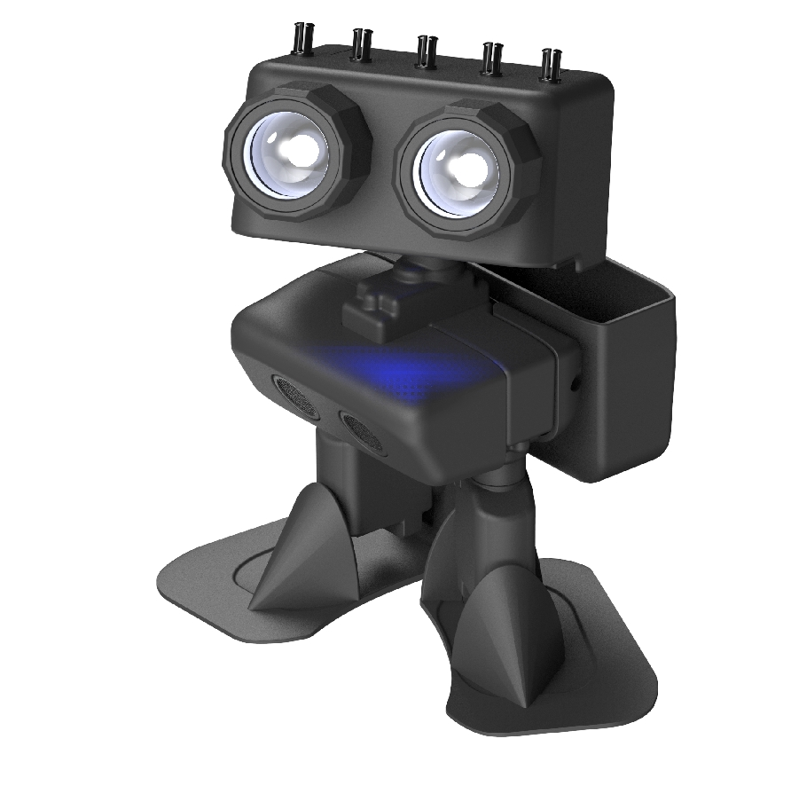

# micro:bit PU Robot



This extension adds MakeCode blocks for the ELECFREAKS PU Robot kit. It covers robot movement, lights, sensors, servo positioning, and radio remote control so teachers can build lessons without editing the low-level robot driver.

The PU Robot kit is available from the [ELECFREAKS store](https://shop.elecfreaks.com/products/elecfreaks-micro-bit-pu-robot-kit).

## micro:bit compatibility

This extension is intended for **micro:bit V2**.

Reasons:

* The robot runtime uses `input.soundLevel()`, which depends on V2 hardware.
* The extension is large enough that simple V1 projects may hit the MakeCode `code too big` limit.

For approval and classroom use, please present this package as **V2 only** in the repository description, icon, README, and product documentation.

## What teachers can do with this extension

Teachers and students can use this extension to:

* make the robot greet, rest, jump, dance, explore, and kick
* set walking direction, step count, and movement speed
* read ultrasonic distance and robot body posture
* control ambience lights and eye brightness
* drive the robot from a second micro:bit over radio
* send text messages and custom control values between controller and robot

## Main block groups

### Setup

Use `set servo trim` and `set walk speed range` before a lesson or after maintenance.

### Actions

Use `set mode`, `stop action`, `set robot move direction`, `walk ... for ... steps`, and the servo blocks to move the robot.

### Sensors

Use `ultrasonic sensor distance`, `body roll`, `body pitch`, `music tempo`, and `front distance array` to react to the environment.

### Actuators

Use the ambience light and eye blocks to provide visual feedback.

### Controller and Receiver

Use one micro:bit as the handheld controller and one micro:bit on the robot. The controller sends joystick, button, and text data over radio. The robot receives values through `enable remote control on group`, `on value received`, and `current value`.

## Example 1: greet and walk

```typescript
input.onButtonPressed(Button.A, function () {
    robotPu.executeAction(robotPu.Action.Greet)
})

input.onButtonPressed(Button.B, function () {
    robotPu.setWalkSpeed(robotPu.MoveDirection.Forward, 4, 6)
})
```

## Example 2: obstacle warning lights

```typescript
basic.forever(function () {
    if (robotPu.ultrasonicDistance(robotPu.DistanceUnit.Centimeters) < 15) {
        robotPu.setAmbienceLight(robotPu.LightSelection.All, 255, 0, 0)
        robotPu.setEyesState(robotPu.EyeState.On, robotPu.EyeState.Off)
    } else {
        robotPu.setAmbienceLight(robotPu.LightSelection.All, 0, 255, 0)
        robotPu.setEyesState(robotPu.EyeState.On, robotPu.EyeState.On)
    }
})
```

## Example 3: simple radio controller

Controller micro:bit:

```typescript
robotPu.setControllerRadioGroup(160)

basic.forever(function () {
    robotPu.sendControlValue(robotPu.SendControlType.Turn, robotPu.readJoystickValue(robotPu.JoystickAxis.Turn))
    robotPu.sendControlValue(robotPu.SendControlType.Speed, robotPu.readJoystickValue(robotPu.JoystickAxis.Speed))
    basic.pause(50)
})
```

Robot micro:bit:

```typescript
robotPu.enableRemoteControlWithGroup(160)

robotPu.onControlValueReceived(robotPu.ControlValueType.Speed, function (value) {
    if (value > 0.5) {
        robotPu.executeAction(robotPu.Action.Greet)
    }
})
```

## Test coverage

The repository includes [test.ts](./test.ts) as a documented smoke test for the public API.

Expected results:

* In the simulator, the project should compile and run without unhandled errors.
* On hardware, Button A should move foot servos, Button B should run the greet action, and Button A+B should send radio test values.
* Sensor reads may return `0` or placeholder values when the physical robot hardware is not connected.

## Further resources

* Product page: <https://shop.elecfreaks.com/products/elecfreaks-micro-bit-pu-robot-kit>
* Repository wiki: <https://github.com/elecfreaks/pxt-PU-Robot/wiki>
* MakeCode approval checklist: <https://makecode.com/extensions/approval>

## Supported targets

* `microbit`

## License

MIT, see [LICENSE.txt](./LICENSE.txt).
